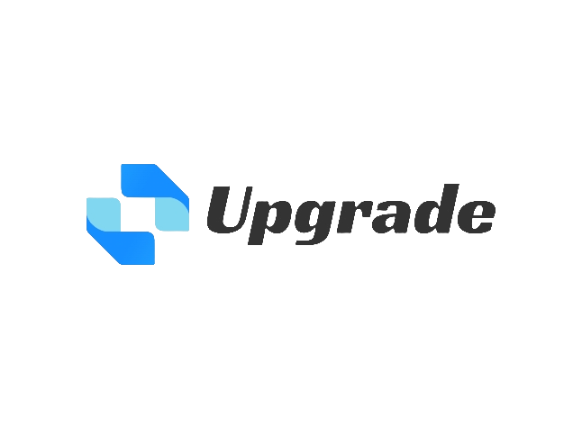

# upgrade-controller
This is a controller that can upgrade Pods in a Deployment in place.



Upgrade 是一个用于原地升级 K8S Deployment 中的 Pod 的控制器
### Prerequisites

- go version v1.21.0+
- docker version 17.03+.
- kubectl version v1.11.3+.
- Access to a Kubernetes v1.11.3+ cluster.

### Quick Start

```shell
# Clone the repository
git clone https://github.com/gitlayzer/upgrade-controller.git

# Go to the controller directory
cd upgrade-controller

# Install the CRD
make install

# Run the controller
make run

# Deploy an example Deployment
kubectl apply -f config/samples/samplle-nginx.yaml

# Deploy an example Deployment
kubectl apply -f config/samples/_v1alpha1_upgrade.yaml

# Check Pods status
root@ubuntu:~# kubectl get pod -o custom-columns=POD_NAME:.spec.containers[*].name,POD_IMAGE:.spec.containers[*].image,PODIP:.status.podIP,START_TIME:.status.startTime
POD_NAME   POD_IMAGE      PODIP         START_TIME
nginx      nginx:alpine   10.244.1.34   2024-04-22T10:16:29Z
nginx      nginx:alpine   10.244.1.33   2024-04-22T10:16:29Z
nginx      nginx:alpine   10.244.1.32   2024-04-22T10:16:29Z

# Check Upgraded Pods status
root@ubuntu:~# kubectl get pod -o custom-columns=POD_NAME:.spec.containers[*].name,POD_IMAGE:.spec.containers[*].image,PODIP:.status.podIP,START_TIME:.status.startTime
POD_NAME   POD_IMAGE      PODIP         START_TIME
nginx      nginx:1.25.4   10.244.1.34   2024-04-22T10:16:29Z
nginx      nginx:1.25.4   10.244.1.33   2024-04-22T10:16:29Z
nginx      nginx:1.25.4   10.244.1.32   2024-04-22T10:16:29Z

# Check Upgrade status
root@ubuntu:~# kubectl get upgrades upgrade-nginx 
NAME            UPGRADERREPLICAS   UPGRADERDEPLOYMENT   UPGRADERTYPE   UPGRADERSTATUS   AGE
upgrade-nginx   3                  nginx                upgrade        Successful       2m6s

# Check Controller logs
root@ubuntu:~/upgrade-controller# make run 
/root/upgrade-controller/bin/controller-gen-v0.14.0 rbac:roleName=manager-role crd webhook paths="./..." output:crd:artifacts:config=config/crd/bases
/root/upgrade-controller/bin/controller-gen-v0.14.0 object:headerFile="hack/boilerplate.go.txt" paths="./..."
go fmt ./...
go vet ./...
go run ./cmd/main.go
2024-04-22T18:24:51+08:00	INFO	setup	starting manager
2024-04-22T18:24:51+08:00	INFO	controller-runtime.metrics	Starting metrics server
2024-04-22T18:24:51+08:00	INFO	starting server	{"kind": "health probe", "addr": "[::]:8081"}
2024-04-22T18:24:51+08:00	INFO	controller-runtime.metrics	Serving metrics server	{"bindAddress": ":8080", "secure": false}
2024-04-22T18:24:51+08:00	INFO	Starting EventSource	{"controller": "upgrade", "controllerGroup": "devops-engineer.com.cn", "controllerKind": "UpGrade", "source": "kind source: *v1alpha1.UpGrade"}
2024-04-22T18:24:51+08:00	INFO	Starting Controller	{"controller": "upgrade", "controllerGroup": "devops-engineer.com.cn", "controllerKind": "UpGrade"}
2024-04-22T18:24:51+08:00	INFO	Starting workers	{"controller": "upgrade", "controllerGroup": "devops-engineer.com.cn", "controllerKind": "UpGrade", "worker count": 1}
I0422 18:37:15.116166 3991587 upgrade_controller.go:79] UpGrade type is upgrade
I0422 18:37:15.132634 3991587 upgrade.go:24] Start to upgrade pod nginx-7494f5f88c-869w7
I0422 18:37:15.141965 3991587 upgrade.go:58] Upgrade pod success
I0422 18:37:15.142722 3991587 upgrade.go:24] Start to upgrade pod nginx-7494f5f88c-bbdnc
I0422 18:37:15.149261 3991587 upgrade.go:58] Upgrade pod success
I0422 18:37:15.149824 3991587 upgrade.go:24] Start to upgrade pod nginx-7494f5f88c-xcdsl
I0422 18:37:15.158018 3991587 upgrade.go:58] Upgrade pod success
I0422 18:37:15.169933 3991587 upgrade_controller.go:74] UpGrade pod is successful
I0422 18:37:15.170140 3991587 upgrade_controller.go:74] UpGrade pod is successful
I0422 18:39:16.421543 3991587 upgrade_controller.go:74] UpGrade pod is successful
```